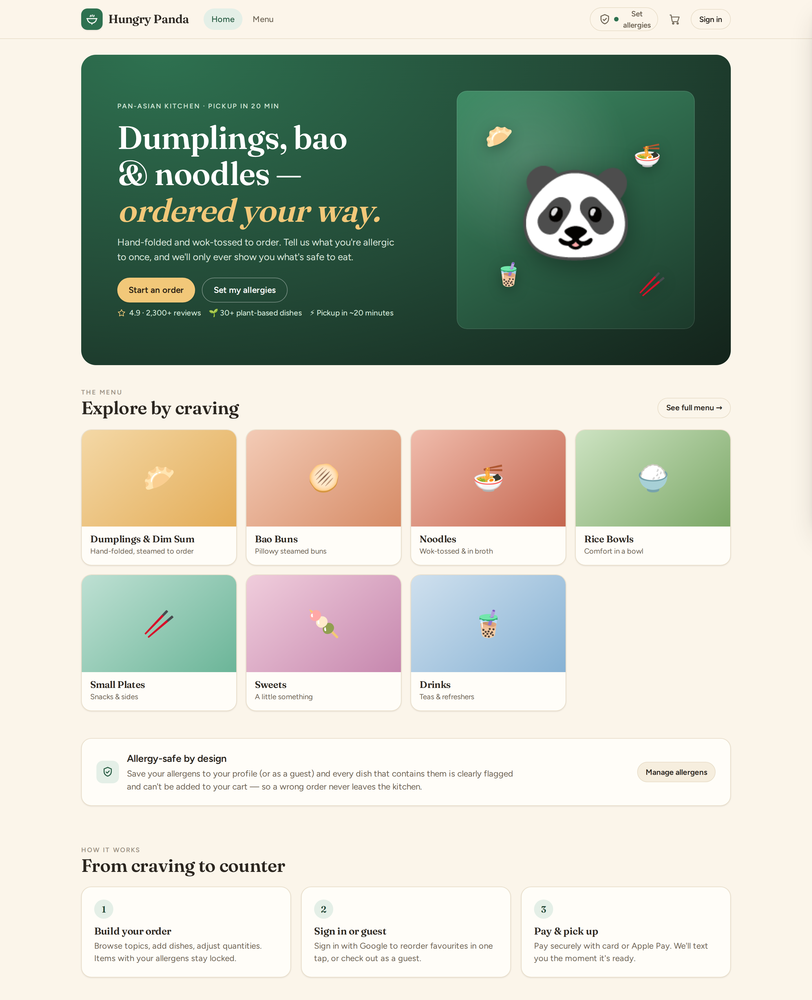
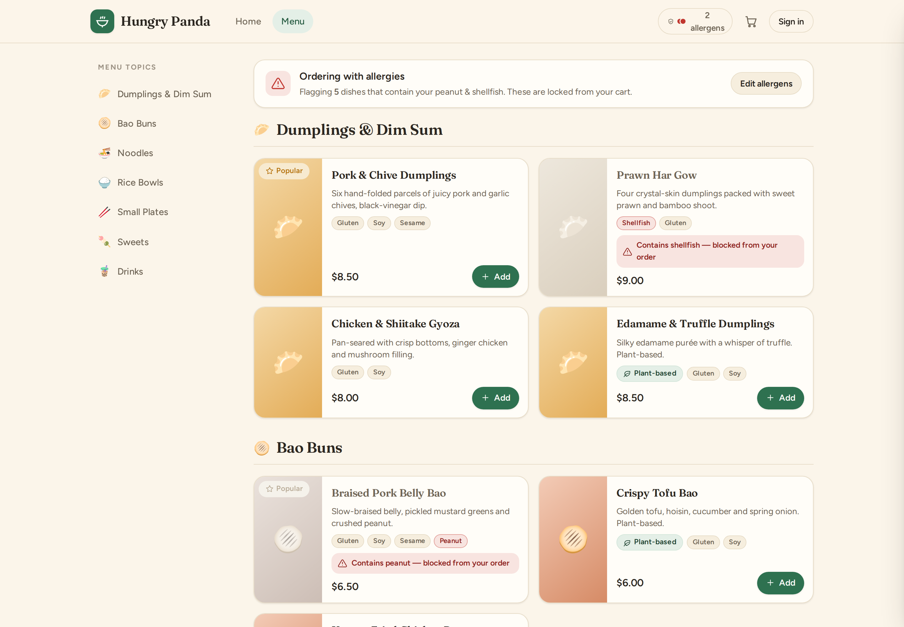
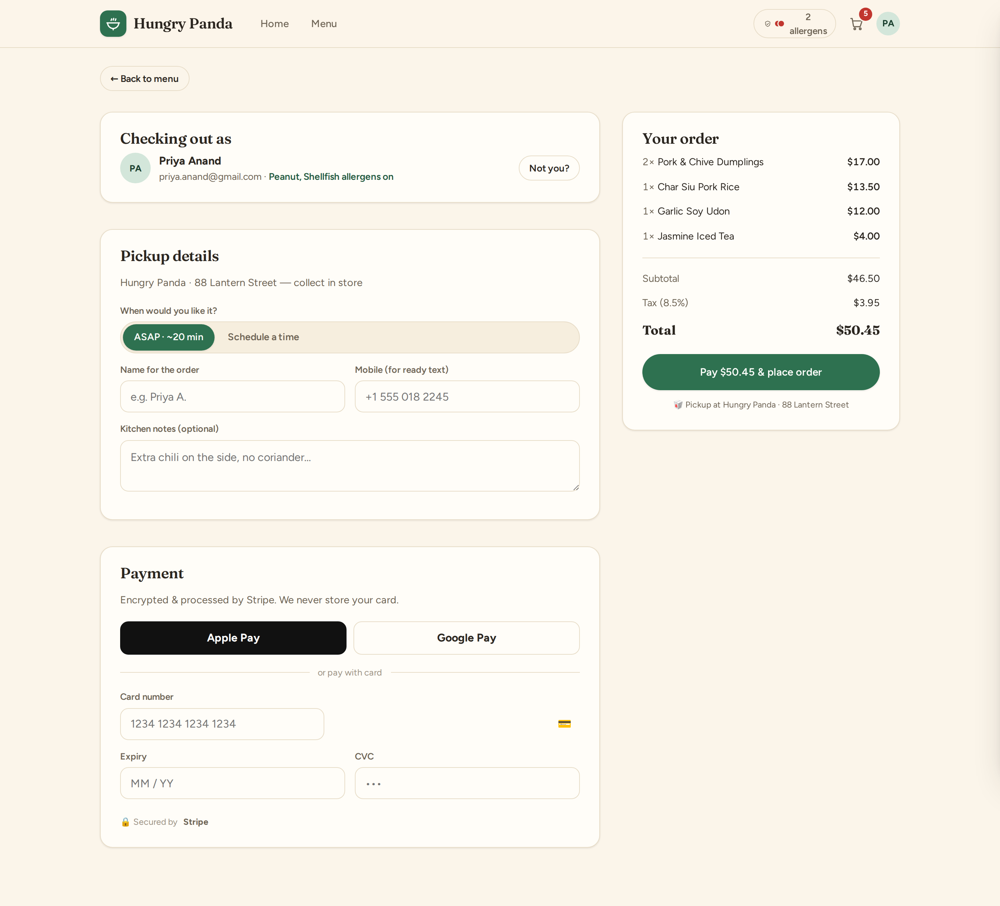
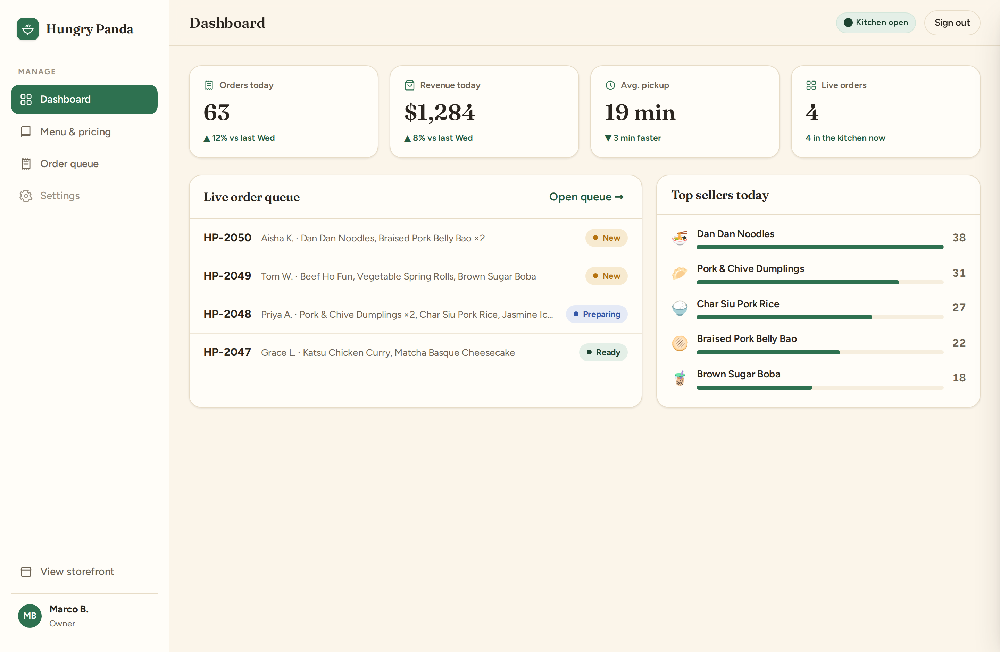

# 🐼 Hungry Panda

A concept + interactive UI prototype for a **pan-Asian takeout ordering website**,
built around **allergy-safe ordering**. Customers browse a menu by topic, tell the
app what they're allergic to once, and every unsafe dish is flagged and locked out
of the cart. Sign in with Google to reorder favourites, or check out as a guest;
pay with Stripe. Owners get an admin console to set the menu, prices, descriptions
and allergens, and to work a live order queue.

> This repository is a **design deliverable**: a written concept/spec plus a
> fully interactive, self-contained HTML prototype and rendered screenshots.
> There is no backend yet — all data in the prototype is in-memory and
> illustrative. The recommended path to a real build is in the spec (§13).

---

## What's inside

| Path | What it is |
|---|---|
| **[`mockups/index.html`](mockups/index.html)** | **The interactive prototype** — open it in any browser. One self-contained file (fonts embedded, no internet needed). |
| **[`docs/concept-and-spec.md`](docs/concept-and-spec.md)** | Concept, feature requirements (MoSCoW), allergen model, data model, architecture, roadmap. |
| **[`screenshots/`](screenshots/)** | 18 rendered PNGs of every screen (light, dark, and mobile). |
| `mockups/index.template.html` | Source template (fonts injected at build). |
| `tools/build-mockup.mjs` | Inlines the web fonts → `mockups/index.html`. |
| `tools/screenshot.mjs` | Drives the prototype through each state and captures the PNGs. |

## Try the interactive prototype

Open **`mockups/index.html`** in a browser. Everything works:

- **Set allergies** (header pill or the green "Set my allergies" button) →
  watch dishes containing them turn red and lock — they can't be added.
- **Add to cart**, adjust quantities, open the cart, go to **checkout**, and
  **place an order** to see the confirmation + status tracker.
- **Sign in with Google** (mocked) to load Priya's saved allergens and order
  history, then **Reorder** a past order in one tap.
- Use the **"Prototype screens"** pill at the bottom to jump to any screen,
  toggle **light/dark**, or reset the demo.
- Jump into the **Admin console** (Dashboard / Menu & pricing / Order queue).
  Edit a dish's price, description or allergens, 86 an item, or advance an
  order's status — changes reflect on the storefront.

## Screens

**Customer:** Home · Allergen-aware menu · Cart · Allergen picker · Google
sign-in / guest · Checkout (Stripe) · Order confirmed · My account (history +
reorder, allergens, profile).
**Admin:** Staff sign-in · Dashboard · Menu & pricing · Order queue.

<p>
  
  
</p>
<p>
  
  
</p>

## Regenerating the build & screenshots

The committed `mockups/index.html` and `screenshots/` are ready to use. To
rebuild them (e.g. after editing the template):

```bash
node tools/build-mockup.mjs     # rebuild the self-contained HTML
node tools/screenshot.mjs       # re-render all screenshots (needs Playwright + Chromium)
```

## Design system (quick reference)

- **Brand:** bamboo green `#2E7150` — the accent. Kept deliberately separate from
  the semantic **allergen** colours so safety always reads clearly.
- **Semantic signals:** chili red `#C1362F` = *blocked / contains your allergen*;
  turmeric amber `#B5720E` = *caution*.
- **Type:** Fraunces (display serif) + Figtree (UI), embedded as base64.
- **Themes:** full light and dark support, following the OS or the in-app toggle.

See the spec for the full concept, requirements and proposed architecture.
